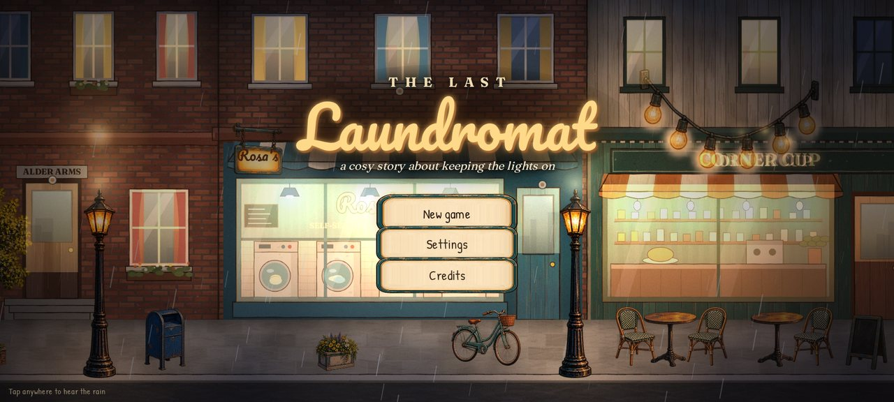
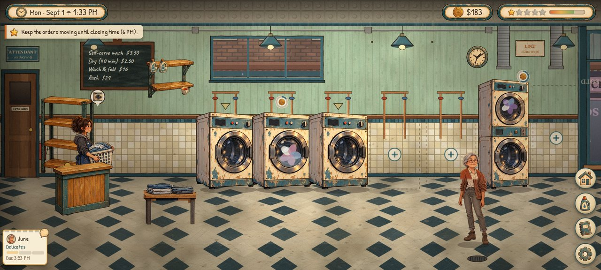
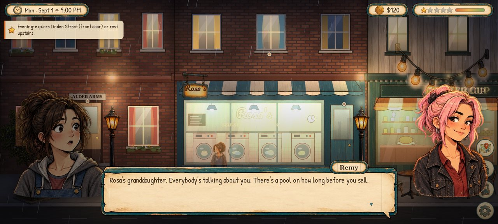
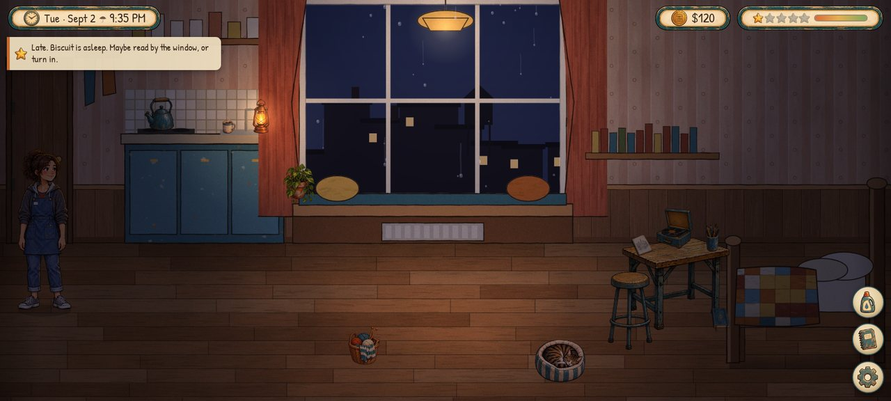
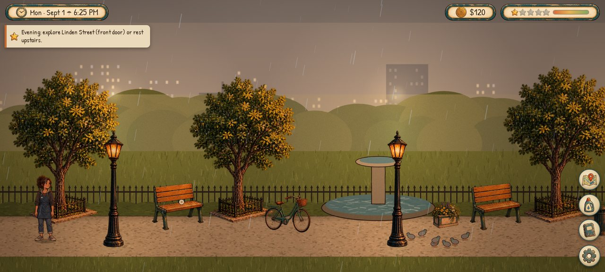

# The Last Laundromat

*A cosy story about keeping the lights on.*

You inherit **Rosa's**, your grandmother's struggling neighbourhood laundromat on Linden Street.
Keep the machines running, fold other people's shirts, and get to know the regulars. You have
28 days before Crestline Properties' deadline, and the choices you make decide what the shop
becomes.

A 2D life-sim and shop-management game for Android phones (landscape, touch).



| | |
| --- | --- |
|  |  |
|  |  |

- **Days in the shop.** Take in drop-off orders, then wash, dry, fold (a swipe mini-game) and
  shelve them before pickup time. Walk-in customers use the machines on their own and pay in
  coins. Fix breakdowns (a timing mini-game), mop puddles and clean lint traps. You can buy
  better machines, decor and supplies.
- **Evenings are yours.** Explore Linden Street, the park, the community garden and the
  riverside. Talk to people, give gifts, take photos, sketch, knit, and collect odd socks.
- **Four friends with their own stories.** Walt, a retired machinist; Maya, a music student
  who works nights; June, a retired teacher who runs the garden; and Remy, a barista who
  paints murals. Each has their own routine and ten friendship levels with scenes along the way.
- **Your choices matter.** How you set prices, open hours and policies changes the shop's
  reputation and community spirit. Friendships decide who stands up for the shop when it
  matters. There are three endings.
- **Rain on the glass.** Hand-painted art with ink outlines and warm lighting. Time of day
  and weather are dynamic, and the music and ambient sound change with where you are.

## Install (Android)

A ready-to-install build is in [`dist/TheLastLaundromat.apk`](dist/TheLastLaundromat.apk).

1. Copy the APK to your phone, or download it there.
2. Open it. Android will ask you to allow installs from that app (the browser or file
   manager). Allow it, then install.
3. It runs on Android 7.0 (API 24) or newer, in landscape. It needs a reasonably current
   Android System WebView (2021 or later), which the Play Store keeps up to date.

Progress saves automatically: at the start of each day and each phase, when you sleep, and
when the app goes to the background. The save is mirrored to the app's private storage, so
it survives the WebView cache being cleared.

## How to play

| Action | Touch |
| --- | --- |
| Walk | Tap the floor |
| Use anything (machines, counter, shelf, people, doors) | Tap it. You walk over and do it |
| Look around a wide room | Drag sideways |
| Fold laundry | Swipe along the arrow |
| Repair a machine | Tap the glowing bolt, then tap again when the needle is in the green |
| Put a load down to free your hands | Tap the counter |
| Swap a finished load for the one you're holding | Tap the finished machine |
| Close up early (after 4 PM) | 🏠 button during a shift |
| Menu / settings / save & quit | ⚙ button, or the Android back button |

The Journal (📓) holds friendships, your diary, collections and the ledger. The detergent
button opens the catalogue for supplies, machines, decor and upgrades. After Day 1 the map
button takes you around the neighbourhood.

## Project layout

```
web/                 The game itself: HTML5 canvas + plain ES modules, no build step
  index.html, css/   Page shell and all UI styling (DOM overlay, scaled to a 720px-tall virtual screen)
  js/engine/         Renderer (camera, lightmap), input, audio, tweens, particles, actors
  js/game/           State & save, day flow, laundry simulation, story director, script language
  js/scenes/         Laundromat, home, exterior locations, title screen
  js/ui/             HUD, dialogue, menus, mini-games
  js/data/           All content: characters, routines, regulars, decor, items, locations,
                     events, endings, and the story scripts in js/data/story/*.js
  assets/            sprites/*.webp (+ manifest.json), bg/*.webp, audio/, fonts/
android/             Android Studio / Gradle project: a small WebView host (Java, no AndroidX)
  app/src/main/java/.../MainActivity.java   serves /web from the APK, immersive mode, back
                                            button, safe-area insets, save backup, vibration
  keystore/          the sideload signing key (see "Signing")
art/source/          The original sprite sheets the game's art is cut from
tools/               Asset pipeline (slicing, background painter, audio build, icons) + test bots
dist/                The built APK
```

## Building the APK

Requirements: JDK 17 and the Android SDK (platform 35 and build-tools), or Android Studio,
which includes both.

```sh
cd android
echo "sdk.dir=/path/to/Android/sdk" > local.properties   # Android Studio writes this for you
./gradlew assembleRelease
# -> android/app/build/outputs/apk/release/app-release.apk
```

`./gradlew assembleDebug` builds a debug variant (`com.thelastlaundromat.game.debug`) that
installs alongside the release build. Gradle packages the `web/` folder straight into the
APK's assets, so there is no copy step.

### Signing

Release builds are signed with the sideload key in `android/keystore/`. It is committed on
purpose, so any rebuild can update an installed copy without losing the save. **Don't use
this key for a store release.** Instead, create your own keystore with `keytool -genkeypair`
and point `android/keystore/sideload.properties` (storeFile, storePassword, keyAlias,
keyPassword) at it.

## Running and testing in a browser

The game is a static site, so any web server works:

```sh
python3 -m http.server 8765 -d web
# open http://127.0.0.1:8765/  (add ?debug for window.__game helpers)
```

To get the phone experience, use your browser's device emulation in landscape. Chrome's
engine is the same one the Android WebView uses.

Static checks you can run any time (no browser needed):

```sh
python3 tools/check_story.py    # every script node referenced exists; every <<command>> is known
node tools/check_exprs.mjs      # every story condition compiles
node tools/check_assets.mjs     # every sprite, background and sound named in code exists
```

Headless test tools (they need Node and Playwright with Chromium):

- `tools/test/shot.mjs` loads the game at phone size and provides helpers for screenshots,
  taps and skipping dialogue.
- `tools/test/bot.mjs` plays a shop shift through the game's own actions, including the
  fold and repair mini-games.
- `node tools/test/campaign.mjs [--days N] [--sell]` plays the campaign day by day: shifts,
  evenings out, talking and gifting. It prints daily stats, the ending reached, and any
  console errors.

## Swapping and adding assets

Every visual and sound is a plain file with a stable name. **To reskin anything, replace
the file and keep its name.**

- **Sprites** live in `web/assets/sprites/<name>.webp`, listed in `manifest.json`.
  Characters, machines, props, portraits (`face_<who>_<expression>`), icons and UI frames
  all live here. You can re-cut them from new source sheets in `art/source/` with
  `python3 tools/slice_sheets.py`; the layout is configured in `tools/sheets.json`.
  `tools/derived_sprites.py` builds the composite poses. Sizes in the game are set in
  virtual pixels, so a higher-resolution replacement just looks sharper.
- **Backgrounds** live in `web/assets/bg/*.webp`: the laundromat, the flat, Linden Street
  (day, closed-bodega and night-lights layers), the park, garden, riverside, skyline and
  map. They are painted procedurally by `tools/paint/scenes/*.js` and baked with
  `node tools/bake_backgrounds.mjs [scene]`. To use your own art instead, drop in a WebP
  with the same name and aspect ratio. Window areas must stay transparent, because the game
  draws the outside view behind them.
- **Audio** lives in `web/assets/audio/{music,sfx,amb}/*.ogg`. `tools/build_audio.py`
  rebuilds everything from the downloaded sources (music tables at the top of the file).
  Ambience files should loop seamlessly.
- **Fonts** live in `web/assets/fonts/`. Change them in `css/style.css`.
- **Launcher icon:** run `python3 tools/make_icons.py` to regenerate every density (and the
  adaptive icon) from `machine_washer_idle`.

## Writing content

All content is data in `web/js/data/`:

- `story/*.js` holds the dialogue scripts, in a small Yarn-like language:

  ```
  === node_id
  walt.content: Lines are  speaker.expression: text   ({name} = player's name, *emphasis*)
  : Narration has no speaker.
  * A choice
    me.laugh: Indented lines belong to the choice.
    <<rel walt 20>>
  <<if hearts.walt >= 5 and not flag.walt_quilt>>
  <<goal "Shown in the goal banner">>
  <<endif>>
  -> another_node
  ```

  Commands include `rel`, `money`, `community`, `petition`, `flag`, `set`, `give`, `decor`,
  `upgrade`, `visit`, `leave`, `emote`, `sfx`, `music`, `letter`, `goal`, `scene`, `call`
  and `ending`. The full list is in `game/story.js`, under `command()`.
- `events.js` says when each script plays: on a trigger (morning, mail, shift start or end,
  a friend arriving, a location, talking, a time of day and so on) with day, weekday and
  condition filters.
- `characters.js` covers portraits, voices, gift tastes and routines (who is where, when).
  `chatter.js` holds everyday conversation pools.
- `regulars.js` has drop-off customers and the notes they leave. `decor.js`, `items.js` and
  `locations.js` define the catalogue, the inventory and the explorable places.

To add a day's story beat, write a node in `story/`, add an entry in `events.js`, and it plays.

## Credits

See [CREDITS.md](CREDITS.md). The music is by Kevin MacLeod (CC BY 4.0). Sound effects are
CC0, from Freesound and Kenney. The fonts are under the SIL Open Font License.
